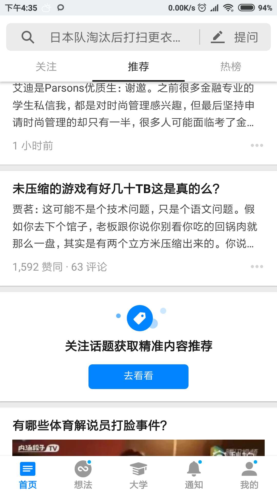
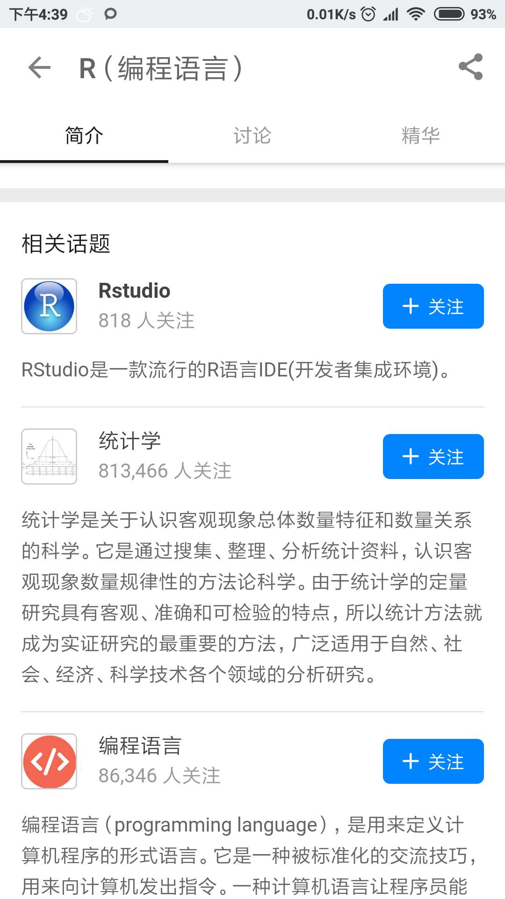
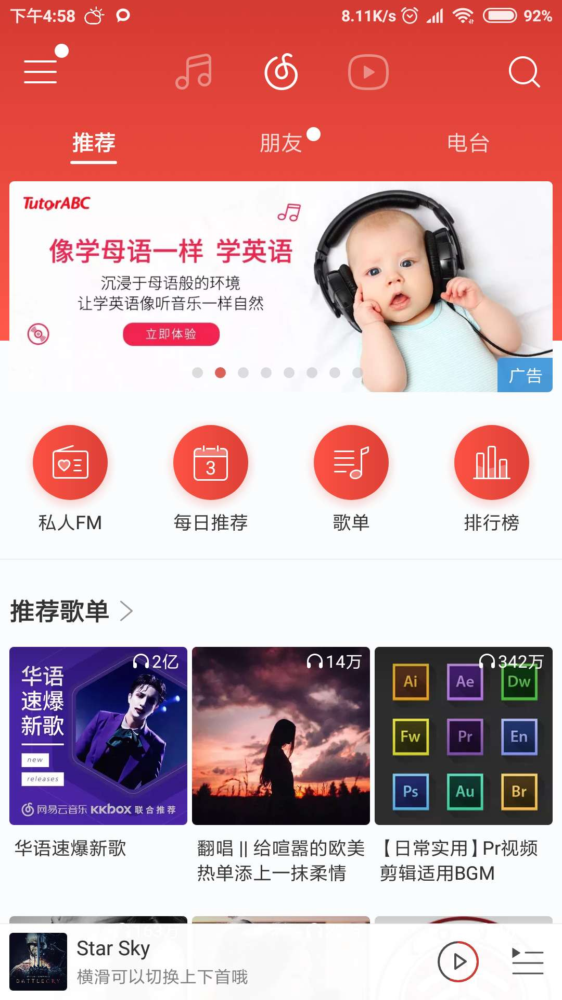

应园子的邀请，我撰写了一篇关于现今流行的内容app的推荐系统的研究与讨论的文章。
事情的起因是这样：
园子同学是知乎的重度用户，曾经有一段时间每天画在刷知乎的时间超过1个小时，其三观深受知乎的影响。
我提醒她：

    不是知乎主动改造你的三观；
    而是根据知乎的推荐，你越刷只会加深自己的固有倾向。
    比如，你是一个比较右的人，推荐系统最后推的都是你愿意点进去看的。
    增加用户花在产品上的时间是推荐系统的目标，而不是解决用户的问题。这样想想是不是挺可怕的
    这样的推荐系统就会导致，你最后只会看到你自己想看的东西。

园子顿时对推荐系统产生了浓厚的兴趣，并“报复”我：

    要不我给你布置个任务吧：正好你最近在研究推荐系统，要不你查查资料，看看目前各大内容APP的推荐系统都是怎么做的，有哪些思路，整理成一篇文章怎么样

<!-- more -->

促使我整理2个月来的实习经验，以及查阅大量公开的资料。
最后总结成为这篇对各大内容APP的推荐系统的研究文章。
本文的目标群众是每天与推荐系统打交道（使用各大内容APP）但又对推荐系统一无所知的同学。

首先，根据app下载量和对园子的影响力，我认为各大内容APP有：

- 知乎
- 网易云音乐
- 快手
- 淘宝

本文还用了很多来自：Netflix, Amazon, Google News, Facebook 这些国外大厂的例子对推荐系统加以说明，因为这些app虽然国内的同学不熟悉，但在推荐系统业内属于引领者。

## 推荐系统的2大类

### 基于内容的过滤

此种过滤只依赖于item的数据。
在一个推荐系统中，被推荐和消费的就是item。如：在今日头条这样的新闻客户端中，一条新闻就是一个item，知乎 -> 一个回答, 网易云音乐 -> 一首歌，快手 -> 一个短视频，淘宝 -> 一个商品。
根据用户填的问卷信息（针对新用户。一般新用户进入一个应用时，都会选择一些自己的兴趣），或者根据用户的评分（针对老用户。老用户会产生很多评分，或其他action，体现出其兴趣），我们发现他对民谣感兴趣，我们就继续给他推荐其它他未消费过的民谣类歌曲。
这里的民谣只是一个tag，表示歌曲的类型，除此之外可能还有歌手名等tag可以利用。

### 协同过滤

此种过滤依赖于其他用户的数据。
协同过滤基于这样的假设：与你类似的用户喜欢的东西，可能你也会喜欢。
这就跟你朋友推荐给你的东西与一个陌生人推荐给你的东西相比，更可能符合你的胃口。因为你的朋友在一定程度上是与你相像的，拥有一些共同的标签。而且根据心理学的研究，人们也倾向于与与自己更像的人交朋友。
协同过滤的原理简而言之就是，找到一群和你相像的用户，把他们喜欢或消费过的item推荐给你。
“相像”的定义有许多，一般会综合考虑用户的基础信息和行为信息。
比如：
如果你的基础信息中有“年龄24岁，女人”，Netflix会把24岁的女人看的多的片子也推给你。
行为信息在Amazon上的体现就是：“你买了A，大部分买了A的用户，同样也买了B，你要不要买B”。

在拥有大量用户的情况下，协同过滤的效果是要好于基于内容过滤的。
其原因可以归咎为：用户自己也不能很确切地定义自己喜欢什么，然而身体是诚实的。这也说成是大数据会比你更了解你。
而且在协同过滤的帮助下，app在你的调教下会越用越好用，越用越舒心，你花在其上的时间也越来越多。
这对老用户的粘性是非常强的。不过反过来说，当你一段时间不使用该app后，你会发现其推荐的内容就不像之前那样符合你的口味了。

当然基于内容的过滤也是很有用。尤其是当一个新用户刚刚登录，还未产生很多动作和基础信息来找到和他相像的人的时候。
吸引新用户是十分重要的，特别是在一个app快速成长的时期。
相对应的，业内会有1日留存率，3日留存率，7日留存率还表示推荐系统对新用户的吸引程度。

## 各大内容app使用的推荐系统

各个厂用的主要推荐算法基本都属于协同过滤的那一大类，由于应用场景的不尽相同（新闻、商品、音乐、电影），使用的算法也不一样。
为了实现冷启动（新用户刚使用时获得比较好的推荐效果），各个厂也会使用基于内容的过滤和基于规则的推荐。
由于推荐系统都是基于内容的公司的核心竞争力，完全公开的是没有的。
而且据一位业界专家所说，每个厂使用的推荐算法基本相同，都是公开的那些；不一样的只是参数、数据和规则；最后推荐的结果也趋于一致。
我们只能在不同的应用场景下进行一些猜测，比如，在内容为音乐的网易云音乐会使用什么样的推荐算法。

### 知乎

知乎的内容以文字为主，现在还加入了很多视频的内容。
作为一个“高素质”人群的问答社区，知乎问题的分类和描述都比较清晰，这有利于更好的推荐。
分析知乎在推荐页给我的推荐内容，知乎的推荐以回答为主，之外还有少量的live和广告。
由于我对live了解不多，这里主要猜测一下“回答”的推荐过程。
最开始知乎的首页是 推荐 和 关注 放在一起的，现在分开了，又加了热门这一页面。
通过推荐页的提示“关注话题获取精准内容推荐”，可以看出，推荐页的内容主要依据的是你关注的话题。这相当于是基于内容过滤的场景。
从结果来看，向我推荐的回答大多是我显式选择的关注话题或者是于此相关的话题（如下图2所示：话题之间有父子、相关等关系），

### 网易云音乐

网易云音乐的推荐可以分为3个板块：私人FM，每日推荐，推荐歌单。

私人FM有3个主要操作：
- 喜欢
- 删除
- 跳过

除此之外还有一些其他的隐式操作，如 完整听完一首歌曲，调节进度条，看评论时长等可以利用。
我们可以将这些行为分为2大类：喜欢和不喜欢。
根据程度不同，可以赋给不同操作不同的喜欢值。
如显式地点击喜欢和完整地听完这首歌都代表喜欢，不过前者更强一点，可以赋给更高的喜欢值。
用户对播放的歌曲产生的所有操作最后求和可以得到用户对这首歌的喜欢程度。
用户在听过一段时间私人FM之后，会产生一系列的操作。
我们就可以得到用户听过的所有的歌曲的喜欢程度。
利用这些信息，再通过协同过滤的一些经典算法，就可以向用户推荐他没有听过的歌曲了。
所以说，私人FM听的越多，推荐效果会越好。

每日推荐一般会与你最近听过的歌曲有关。也就是说，歌曲的兴趣对今天推荐的影响随时间衰减比较快。
比如，你昨天听了电音，比较喜欢，接连听了几首，可能还“喜欢”了一些。今天的每日推荐就会推更多的电音给你。

推荐歌单算是比较容易推荐的一个板块。因为歌单都是专家或是爱好者组建的，将很多歌曲按照某一标准归为一类。每个歌单还都有自己的标签可以利用。如摇滚、英伦、另类、独立。这些标签都是区分性很强的。
在向我推荐的歌单里，一般包含几首我“喜爱”的歌曲。由此可见，推荐歌单使用了“我喜欢的音乐”中的信息。如果几首你喜欢的音乐同时出现在一个歌单中，那么很大程度上可以预测，这个歌单中的其他音乐也会被你喜欢。

### 快手

快手作为一个短视频平台，每天用户会产生大量的视频。视频相对而言是不那么好推荐的，因为

- 视频内的语义现在用机器理解还是很困难的
- 被推荐的内容几乎都是冷启动的，也就是说要争取推荐最新上传的视频

在这种情况下，快手可能使用了标签这一信息作为推荐的主要依据。
用户上传的视频可以被用户自己打上各种标签：社会摇，炫技，教程，小吃等。
依靠这些标签把用户和视频聚成不同的类。这样新上传的视频就可以利用用户在老视频上产生的操作了。

### 淘宝

淘宝作为一个c2c的电商平台，推荐系统的指标与其他b2c电商（如 亚马逊）有所不同。
评价一个推荐系统好坏的指标中有一个是对冷门产品的发掘能力，即对[长尾](https://baike.baidu.com/item/%E9%95%BF%E5%B0%BE%E6%95%88%E5%BA%94)的尾端进行推荐。
使用推荐系统将冷门产品的商家和顾客联系起来是淘宝的一个卖点，因为淘宝上的商品实在太多了。没有你买不到，只有你想不到。
根据亚马逊公开的一些信息，电商系统的推荐系统核心可以用一句话概括：买了商品A的人，同样也买了B，你买B呀？

## 为什么说推荐系统在改造和奴役你的思维

对于一个内容app的推荐系统来说，推荐好不好的指标最后都会反应在用户停留在该app上的时间。
在互联网上网人数趋于饱和的情况下，整个市场用户时间数不会像之前那样快速增长，如何抢夺用户宝贵的时间就成个各个内容推荐系统的目标。
为了让你停留在本应用的时间增加，各大内容app可谓用心良苦。
如知乎现在移动端网站会向app内导流。之前即使用户不登陆、在移动端网页上也可以享受到所有的信息。
现在在移动端网页上只能看到一个回答的开始部分，想要浏览完整部分就不许下载并进入知乎的app才可以。
很大程度上降低了用户体验。比如我的朋友经常会分享一些知乎上的回答或问题给我，我必须点击多次用app打开才能看到完整信息，很是不爽。
今日头条之前也因为三俗内容被政府多次约谈。就是因为相比其他的新闻，低俗、色情的东西更容易吸引网民们的眼球。
就像本文最开始谈到的那样，推荐系统为了增加用户停留的时间。只会一味地迎合用户的喜好，无论用户的喜好是否正确。
整个过程就是一个正反馈。你思想比较右，推荐系统会推符合你口味的内容，加深你的兴趣。
对一个成年人来说，还有甄别内容和选择平台的能力。
对于广大的未成年人，无疑会是一种误导。再加上现在互联网内容的监管并不是很完善。为了利益，推荐系统推给未成年人的不会是正能量，只会是娱乐导向、甚至低俗的内容。这对未成年人的思想塑造会有很不好的影响。

其实很多成年人又成熟多少呢？想想你被推荐的内容，想想你花在这些内容app上的时间。
在此引用一句古话：“良药苦口利于病，忠言逆耳利于行”。然而作为推荐系统，只会给你说好听的，你喜欢听的。
在潜移默化之中，你的思想已经被推荐系统所改造和奴役了。

依赖于推荐系统的内容也是一种懒惰的表现。相比 主动去获取信息，直接接受推荐系统的内容 要容易、愉快的多。但要记住，懒惰是有代价的，你的思想将不可避免地变得狭隘。

## 如何避免推荐系统的恶果

### 多读书

无论知乎给你怎样的错觉，书本上的内容在质量上还是高的多。
我最近读了一本斌卡的《一平米健身》，相比知乎上的健身类回答，内容的质量要高的多。
毕竟相比在网络上写个回答来说，出书的门槛和花费的精力要多的多。
尤其是，书本上还承载着互联网之前人们的原创思想。这是知乎上所没有的。当然，经过不断搬运，许多"知乎er"把书本上的知识运用在回答中。不过这些都是经过加工和断章取义的，也有不少从某本书上搬一段话就获得高赞的案例。

### 与优秀的人交朋友

与优秀的人交朋友，聊天，比起把时间花在追随大v的言论要有用的多。
我总认为，一个人在互联网上呈现给你的是他想给你看的部分，不完全。
相比之下，虽然面对面的交流也通常是会掩盖本性的，但这种信息交互是双向的，而非通过follow关系的单向信息输出。
而且，不知道大家有没有这样的感觉。与优秀的人交流时，自己会花更多的精力去思考，而非听完就完事儿了。在知乎这些平台上，看完之后的热度保持的并不长久。

### 接触不同的内容，才能够塑造一个完整的三观

不要只看自己喜欢的，也要听取不同的声音。党同伐异是人类的天性。如果你不刻意去避免这一人性上的缺点的话，推荐系统会像一个谄媚的奸臣一样，只说你想听的，而你可能就会想历史上的昏君一样，荒废了朝政。广开言路，逆耳忠言才是明君应有的表现。
比方说，当你听到与你不同的言论，不要先想着反驳对方，试着想想为什么对方会这样想？
每个人的想法都是其经历和体验的体现，没有相应的经历，很难会理解一些不一样的事情。这个时候不要着急去反驳对方，而是试着丰富自己的阅历。
之前说的2条“多读书、与优秀的人交朋友”都是丰富自己阅历的高效途径。

## 后记

希望大家作为一个成年人，拥有一个独立的三观，不要被推荐系统和自己的懒惰而奴役。