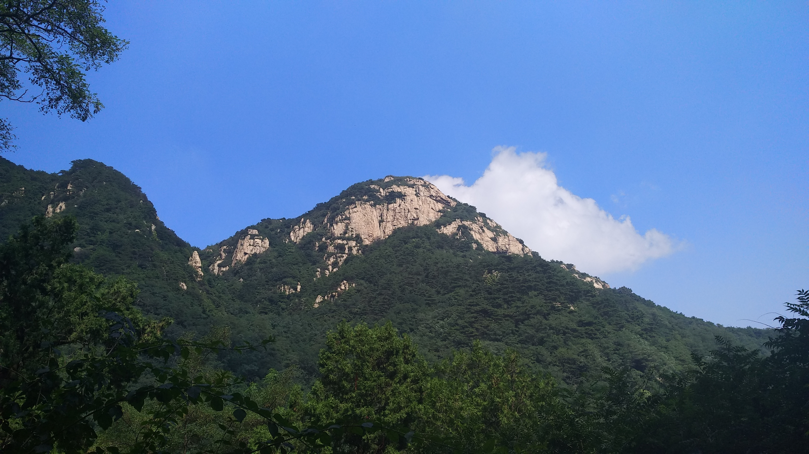
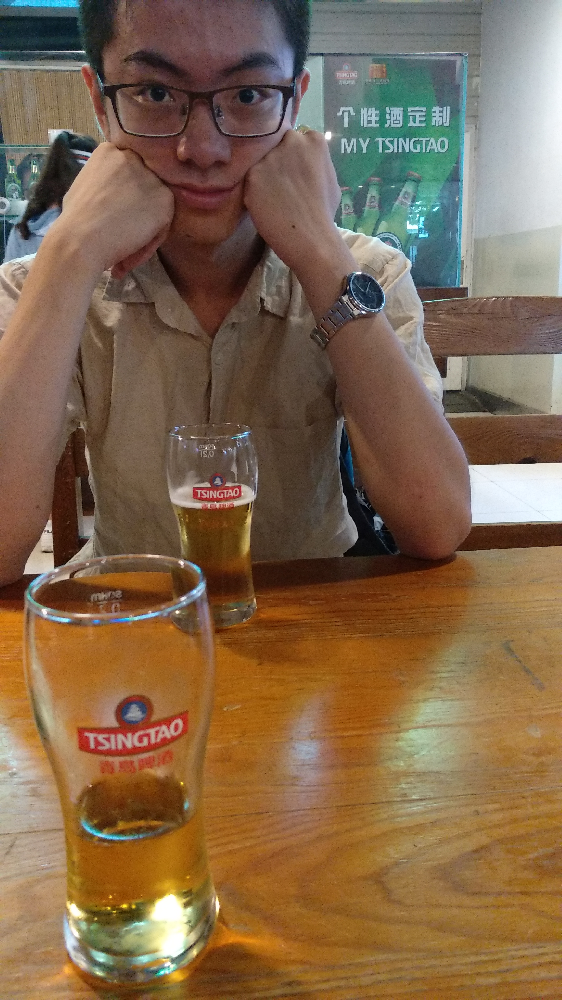
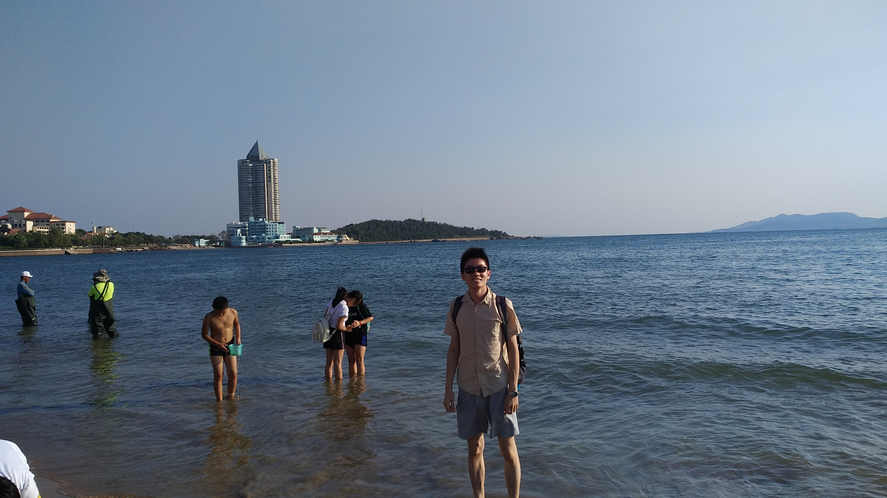
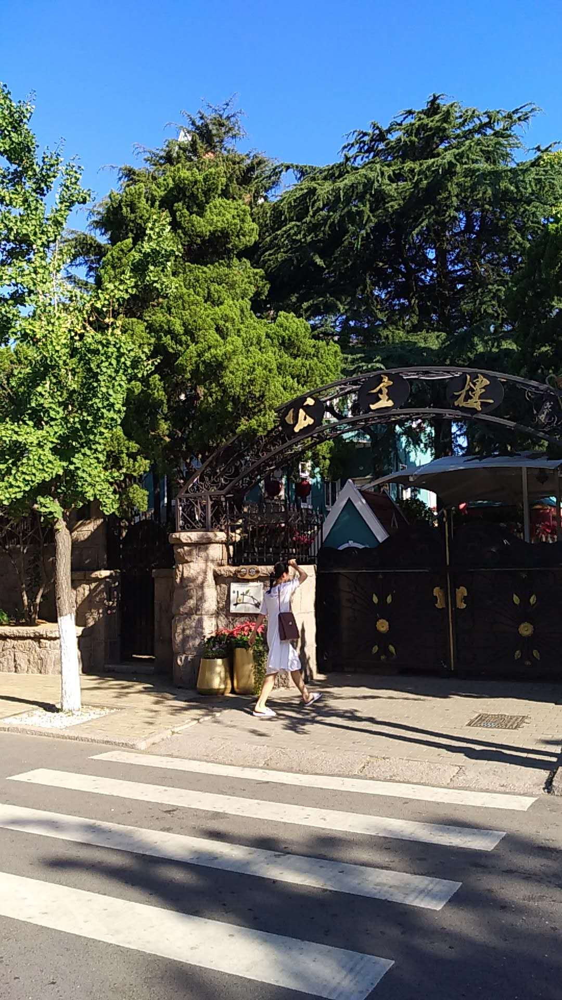
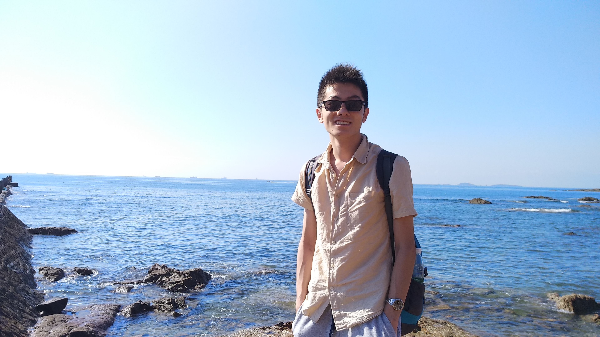
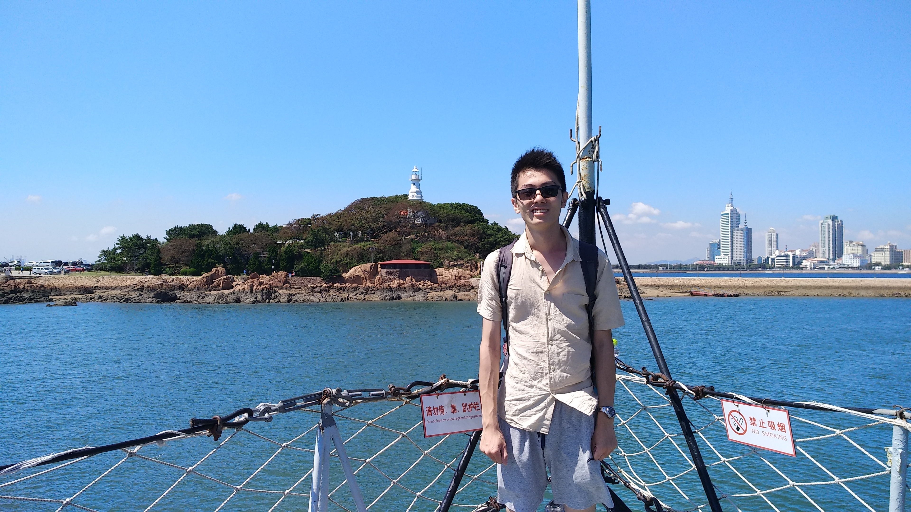
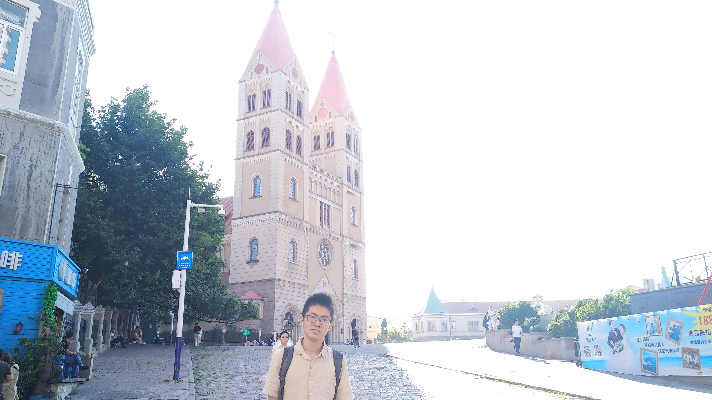
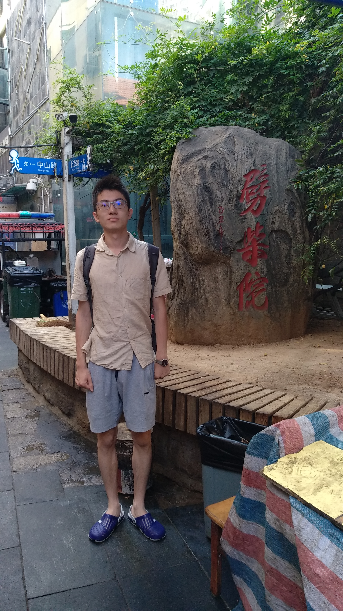

8月21号 至 8月28号，带着自我放逐的心情，我去山东玩了7天。小时候（2008年）曾跟着爸爸和旅行团来过山东旅游，经典的旅游城市，包括青岛、烟台、威海 和 隔海相望的大连，都逛了一圈。当时年纪尚小，天真烂漫，只觉得不用上学，来到陌生的地方旅游，十分有趣。如今十年过去了，同样的景点，却有不一样的心情和感受。

此次旅行是临时决定的。之前同学叫着去重庆做毕业旅行，我由于种种原因没去成。8月中旬后，经历了情感上的波折和三毛流浪文学的洗脑，恰好有山东的同学(我们可以称之为“女声男”，因为其声音特别有雌性)邀请我去山东一起玩。我便答应了。希望通过此次旅行让心情好过一点，让匆忙的旅行占据自己的大脑，不去想不该想的苦恼。

<!-- more -->

办完了学校的事情，买了21号晚上的硬座票，踏上6个小时去济南的火车。到达济南后，我在火车站对面的一家“潼关肉夹馍”，补充了些能量；更重要的是给手机充了电。因为前半年摔了几次手机，可能是什么硬件坏掉了，手机掉电比较快，不像之前可以一撑撑一天。这家店再次证明了：火车站周边的饭店果然味道很差。之后赶往济南汽车站，坐上去 莱芜 的流水车。跟随女声男的指示，我在张家洼下了车。他来接我的时候，手机只有1%的电量了。由于舟车劳顿，我先在女声男的卧室里睡了一觉。中午一起吃他妈妈做的饭。饭菜味道很一般，但还算丰盛。下午去市区，逛了超市，看了场电影《快把我哥带走》。莱芜确实是个生活很方便的地方。路上车也不多，各种基础设施和娱乐场所都很多。晚上，在张家洼吃火锅。之后女声男开车，载着我和他妈前往北边的雪野湖，看水、散步。去的过程中，我的膀胱爆炸。我们直接在路边停车，解决了膀胱的压力。回到家里，我们又和色长、涂导开了2局农药，才睡觉。

行程的第二天。我们按照计划去泰山玩。从莱芜坐流水车到泰安，然后换乘公交到泰山脚下。公交车还坐反了方向，坐了一站下车后。我指着身后的山说：咱们傻逼了，应该冲着山的方向走。从11点开始爬山，花了近5个小时终于登顶。开始登山的时候还发生了一件有趣的事情。女声男打算买个自拍杆，拍照更方便些。买下后才发现，我的米6没有3.5mm的耳机孔，他的Max屏幕太大，装不上。好说歹说，店家才给我们退了。作为五岳之首，泰山吸引了全国各地的游客前来，登泰山的游客很多。海拔1532.7米，孔子讲“登东山而小鲁，登泰山而小天下”。登上山顶，眺望山下，才发现，登泰山只能小泰安。后来想想，地球是圆的，登珠穆朗玛峰都不可能小天下。泰山景区的建设也完善。全程都是很宽的台阶，说是登山，其实全称都在爬台阶。每隔一段就有个休息点，一般有食物和水，还有各种纪念品。下山按照计划，乘坐缆车到山腰的中天门，再坐中巴到山下。缆车真是排队半小时，下山5分钟。之后坐拼车回莱芜，准备明早去烟台莱州看海，顺便找另一个同学玩。值得说的一点是，山东不愧是经济发达的东部省份，生活各种方便。乘车、买门票、坐缆车都可以使用移动支付。当然，出门玩还是需要带现金的。比如坐中巴就只能用现金。

行程的第三天。由于没买到去莱州的汽车票，我们临时改变行程，去了旅游城市 青岛。开始了青岛3日游。青岛不愧是旅游城市，各种吃喝玩乐和景点建设的十分齐全。在这里，我真正体会到旅游的热情。第一天，体验了青岛的公交、参观了啤酒博物馆、在海滨第一浴场游了泳。青岛的公交车司机素质比北京不知道高到哪里去，对乘客和游客很友善。北京的司机师傅可能是平时压力比较大吧，总是没有好脸色给乘客。啤酒博物馆里，我们参观了青岛啤酒的历史和生产线。品尝了正宗的“原浆”和“纯生”青岛啤酒。下午在海滨第一浴场游泳。好在不是周末，人虽多，但还没有到下饺子的盛况。脚踩在细软的沙滩上，沐浴着和睦的阳光；沉浸在被阳光晒得十分暖和的海水中，享受海浪的冲击和海风的吹拂...美滋滋。当然也品尝到不少海水的苦涩。

青岛的第二天。
一大早，去八大处风景区，见识了权贵住的别墅，在公主楼前徘徊了半天。然后去旁边的海边赶海。所谓赶海就是，趁着落潮的时候，在充满礁石的海边捡各种海鲜。由于技艺不精、工具不全和时候比较晚，自然收获不多。甚至还在海里摔了一跤。这里还遇到了在岩石上照婚纱照的情侣，和照全家福的青岛人。不得不说，这里风景真心不错。大海、蓝天、城市、市民，形成一幅和谐的画面。
然后打车去了 海军博物馆，参观了“坚船利炮”。核潜艇由于人太多，没有上去“开”。
沿着海岸线，我们出发去“监狱”。路上随便找了个店，吃了些饺子。德国监狱 更多的是爱国主义教育。宣传日占时期，日本法西斯的暴行。有趣的是，在买票的时候，售票员由于和我们聊天，还被其他游客diss了。售票员检查我们的学生证，发现已经毕业一个月了，但看到是“北京航空航天大学”，说是她女儿想上这所学校，开飞机。问了问分数线的情况。我们一个山西考生，一个上海考生，自然不知道山东(高考大省)的情况。而且我航也不是培养开飞机人才的呀！所以就瞎说一通，混了个半价门票。
参观完监狱后，我们沿着海边一直走，来到了栈桥。这个地方我依稀有些印象，10年前也曾经来过。不过如今已经物是人非，我也不是曾经的我了。女声男嫌桥上人太多，就没有上去。我一个人转了20分钟，在桥头伫立了一会儿，看着大海和远方的城市、山丘，陷入了对往日的沉思。在栈桥上，可以看到上午参观过的海军博物馆。我们相当于一直在沿着海岸线走。
晚上我们又来到栈桥，坐在桥头的石头上，享受着海风尽情地吹拂。在海边吹风时，看到明月当空，还是会想起她。
我们还在中山街逛了一遍，吃了小吃，参观了各种礼品店。小小破费一晚。

青岛的第三天。
参观了酒店附近的天主教堂、劈材院、建设银行旧址。我们的酒店就在老城区，离中山街、栈桥都特别近。
进入天主教堂时，里面的主教在宣扬天主教认同的夫妻关系，我们还见证了6个教徒入教。人民生活在苦难中，向宗教寻求慰藉。
劈材院是一个小吃街。由于我们是上午去的，没什么人，店铺也开的不多。
然后坐公交去汽车站，乘大巴回莱芜。
回到莱芜又在张家洼村的院子里吃了露天的烧烤。

行程第六天--济南。
由于女声男感冒了（另一个原因是太宅了），我只好一个人去济南玩。
坐汽车到济南，直奔提前订好的青旅(济南滨湖青年旅舍)。这是我第一次独自住青旅，也是第一次在国内住青旅。这家青旅的优点在于位置好，紧邻大明湖畔。一个10人间的混住房间，但只有我和一个大叔住。大叔是个有趣的人。他来济南的目的是躲避花粉。他工作在辽宁。每年入秋会南下，避免过敏。今年去过北京和石家庄，最后来到济南，感觉这里空气不错，就找了家青旅（相对酒店便宜的多），打算住上十几天。我下午出去玩的时候，他在床上躺着，晚上10点回来的时候，还在床上躺着。第二天早上我出去玩的时候，他还躺着。中午我回来退宿和他道别时，他还躺着。不是在睡觉，就是在玩手机。
济南的景点比较有限，也比较集中。由于交通更方便的原因，我第一天下午和晚上逛了 大明湖、五龙潭、趵突泉、泉城广场、芙蓉街。晚饭在芙蓉街吃小吃，吃到撑。济南作为泉城，水真多。我甚至看到马路边上的井盖都在咕咕地向外冒水(而女生男听说了，分析说更可能是城市排水系统出了问题)。慕名而去的趵突泉，其实一般，只有3股大泉咕咕的往外冒，早已不复当年盛况。据说曾今还停过水，近年来政府治理地下水位，才重新复涌。

行程第七天--千佛山。
济南必去的地方有3个：大明湖、跑突泉、千佛山。千佛山在城市的南郊，所以我安排在了第二天上午。千佛山不算高，也不难爬。我一个半小时上去，一个小时下来，在山顶休息了半小时。登上千佛山，可以俯瞰整个济南。千佛山上还有很多佛教和道教的庙宇、雕塑。我不是很懂，大多数景点也只是走马观花而过。
回青旅的路上吃了济南名吃--把子肉。确实挺好吃的，肥而不腻。我点了一片肉，一碗米饭，就这样吃了。
济南到临汾只有一辆直达车，全程5个小时多，向北途径石家庄、太原，才向南到达临汾。济南西站远离市区，坐公交坐了一个半小时才到，中间还需要换乘。

晚上8点抵达临汾西站，结束了7天的旅行。

## 后记

离开富庶的东部强省山东，回到破败的中部弱省山西。没有对比就没有伤害。十年前，不知道父亲过来旅行时，没有被这些感染，产生走出山西的想法吗？如果是那样的话，作为儿子的我，现在一定会过的更好吧。而我还没有见识过足够的地方，自己也不知道将来会待在哪里。起码北京这个城市没有产生让我特别想长期居住在这里的想法。趁年轻，多走一走，多看一看，再做决定吧。

我在青岛时会想，自己老了(也不一定要十分老，但起码要财务自由)以后，就每一年换一个地方住。租上一年的房子，和自己爱的人一起探索这个地方。体验不同的工作和生活。这样的话，这一生一定会更精彩。