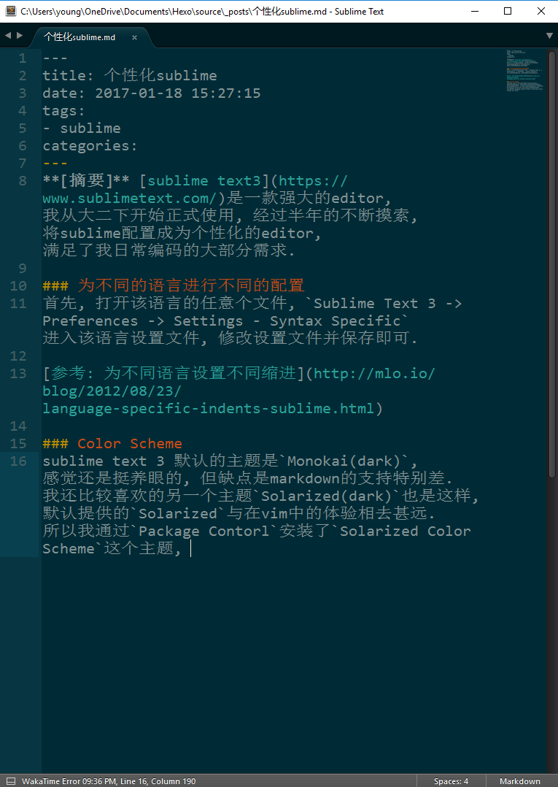
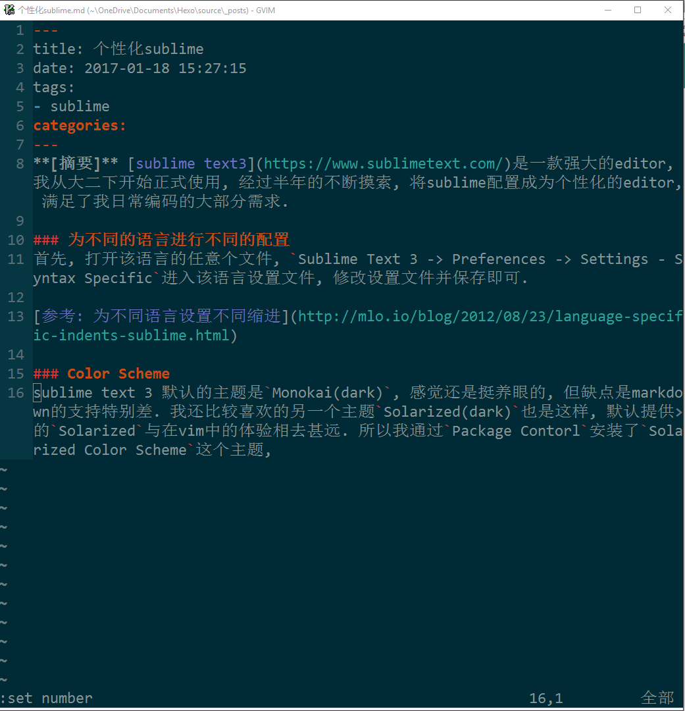

**[摘要]** [sublime text3](https://www.sublimetext.com/)是一款强大的editor, 我从大二下开始正式使用, 经过半年的不断摸索, 将sublime配置成为个性化的editor, 满足了我日常编码的大部分需求.

### 为不同的语言进行不同的配置
首先, 打开该语言的任意个文件, `Sublime Text 3 -> Preferences -> Settings - Syntax Specific`进入该语言设置文件, 修改设置文件并保存即可.

[参考: 为不同语言设置不同缩进](http://mlo.io/blog/2012/08/23/language-specific-indents-sublime.html)

### Color Scheme
sublime text 3 默认的主题是`Monokai(dark)`, 感觉还是挺养眼的, 但缺点是markdown的支持特别差. 我还比较喜欢的另一个主题`Solarized(dark)`也是这样, 默认提供的`Solarized`与在vim中的体验相去甚远. 所以我通过`Package Contorl`安装了`Solarized Color Scheme`这个主题, 与vim对照如下, 还是比较养眼.

